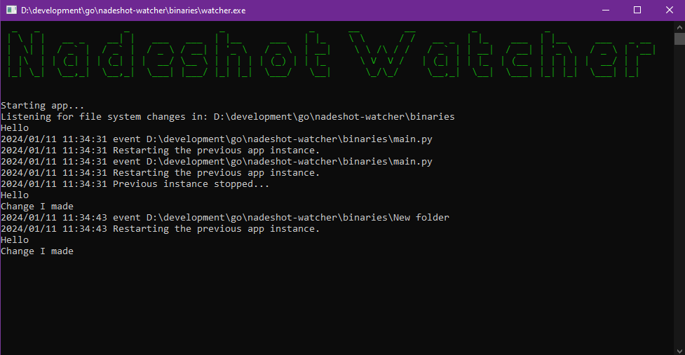

## Nadeshot Watcher
Self-Restarting Python Appplication Development Tool. To simply put it, it aids with real-time python development.

### Demo

### Why?
I was looking for an efficient way to restart my real-time running apps while I was doing changes to the source code. There are a lot of opinions of what to use, but none come as a 1 exe file that does that for you.

### How does it work?
Nadeshot Watcher uses Go-Routines to start proceses for you, in essence, it will start your Python Script  / Bot for you and keep it running, until it detects file system changes, once that happens, it restarts it and removes the previous thread / go-routine. 

### Why 2 variants?
Simple, if you use Docker, it doesn't like file system events, instead of using that, the program indexes everything consistently and then detects changes. 

### Which should I use?
 - Docker -> Docker
 - Regular -> Windows / Linux

This program is part of [Discord Nadeshot](https://github.com/alexanderthegreat96/discord-nadeshot), my discord bot framework.

#### Configuring a different start-up file than main.py
In the application directory, create a new file called: watcher.ini
```text
my-script.py
```
Now the watcher is always rebooting my-script.py

#### No licence, EVERYONE IS FREE!!!