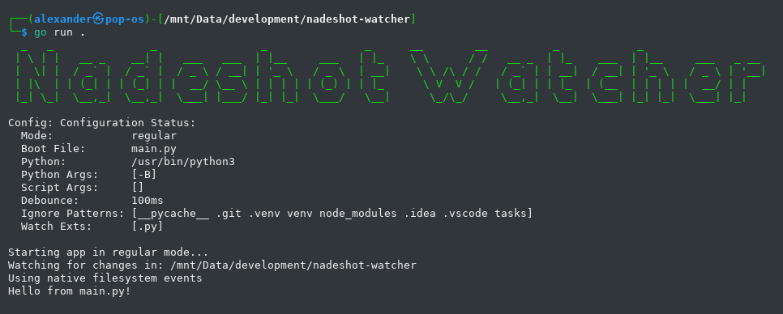

# Nadeshot Watcher

> 🔄 Self-Restarting Python Application Development Tool

A single binary that aids with real-time Python development by automatically restarting your app when source files change.



## ✨ Features

| Feature | Description |
|---------|-------------|
| **Single Binary** | One executable works on Windows, Linux, macOS, and Docker |
| **Two Watch Modes** | Native filesystem events OR polling (for Docker/network filesystems) |
| **Debounce** | Prevents rapid-fire restarts when saving multiple files quickly |
| **Graceful Shutdown** | Handles SIGINT/SIGTERM to cleanly stop your Python app |
| **Configurable Python** | Supports custom interpreters, venv paths, and arguments |
| **Script Arguments** | Pass arguments to your Python script |
| **Extension Filtering** | Only watch specific file types (`.py` by default) |
| **Ignore Patterns** | Exclude directories like `__pycache__`, `.git`, `node_modules` |
| **Support for custom paths**| Store the executable anywhere and point it towards your python project using --path |

## 🚀 Quick Start

1. Download or build the `watcher` binary
2. Place it in your Python project directory (alongside `main.py`)
3. Run `./watcher`

## 🚀 Quick Start Using Custom Paths
1. Download the binary
2. Store it anywhere you want
3. Optionally, create an alias in your terminal
4. Run: `watcher --path <your-project-path>`
5. The watcher will create a `watcher.ini` file in your project directory, which you can modify later
6. That's it. This method ensures that for some projects you can use a single binary to do the same thing, while, for other complex projects requiring all the dev deps to be in the same folder, you can store the binary there.

That's it! The watcher will start your `main.py` and restart it whenever you save changes.

## ⚙️ Configuration

Create a `watcher.ini` file in the same directory as the watcher binary:

```ini
# Nadeshot Watcher Configuration
# All settings are optional - sensible defaults are used

# Mode: "regular" for native filesystem events (Linux/Windows/macOS)
#       "docker" for polling-based watching (Docker/network filesystems)
MODE=regular

# Python script to run (must end with .py)
BOOT_FILE=main.py

# Python interpreter command
# Examples: python, python3, /path/to/venv/bin/python
PYTHON=python

# Arguments for the Python interpreter
# Common flags: -B (no bytecode), -u (unbuffered output), -O (optimized)
PYTHON_ARGS=[-B]

# Arguments passed to your Python script
# Example: SCRIPT_ARGS=[--debug, --port, 8080]
SCRIPT_ARGS=[]

# Cooldown period in milliseconds between restarts
DEBOUNCE_MS=500

# Directories/files to ignore (changes won't trigger restart)
IGNORE=[__pycache__, .git, .venv, venv, node_modules, .idea, .vscode]

# File extensions to watch (only these trigger restarts)
WATCH_EXTENSIONS=[.py]
```

### Configuration Options

| Option | Default | Description |
|--------|---------|-------------|
| `MODE` | `regular` | `regular` (fsnotify) or `docker` (polling) |
| `BOOT_FILE` | `main.py` | Python script to run |
| `PYTHON` | `python` | Python interpreter path/command |
| `PYTHON_ARGS` | `[-B]` | Arguments for Python interpreter |
| `SCRIPT_ARGS` | `[]` | Arguments for your script |
| `DEBOUNCE_MS` | `500` | Cooldown between restarts (ms) |
| `IGNORE` | `[__pycache__, ...]` | Patterns to ignore |
| `WATCH_EXTENSIONS` | `[.py]` | File extensions to watch |

## 🐳 Docker Mode

When running inside Docker containers or on network filesystems, native filesystem events don't work reliably. Use polling mode instead:

```ini
MODE=docker
```

This uses polling-based file watching (checks every second) instead of relying on filesystem events.

## 🔧 Building

```bash
# Build for current platform
go build -o watcher .

# Cross-compile for different platforms
GOOS=linux GOARCH=amd64 go build -o watcher-linux .
GOOS=windows GOARCH=amd64 go build -o watcher.exe .
GOOS=darwin GOARCH=amd64 go build -o watcher-darwin .
GOOS=darwin GOARCH=arm64 go build -o watcher-darwin-arm64 .  # Apple Silicon
```

## 🧪 Testing

```bash
# Run all tests
go test ./... -v

# Run with coverage
go test ./... -cover
```

## 📁 Project Structure

```
nadeshot-watcher/
├── main.go              # Application entry point
├── config/
│   ├── config.go        # Configuration loading (uses envparser)
│   └── config_test.go   # Config tests
├── functions/
│   ├── functions.go     # File watching & process management
│   └── functions_test.go
├── watcher.ini.example  # Example configuration
├── go.mod
└── README.md
```

## 🔗 Related

This program is part of [Discord Nadeshot](https://github.com/alexanderthegreat96/discord-nadeshot), my Discord bot framework.

## 📄 License

**No license, EVERYONE IS FREE!**
